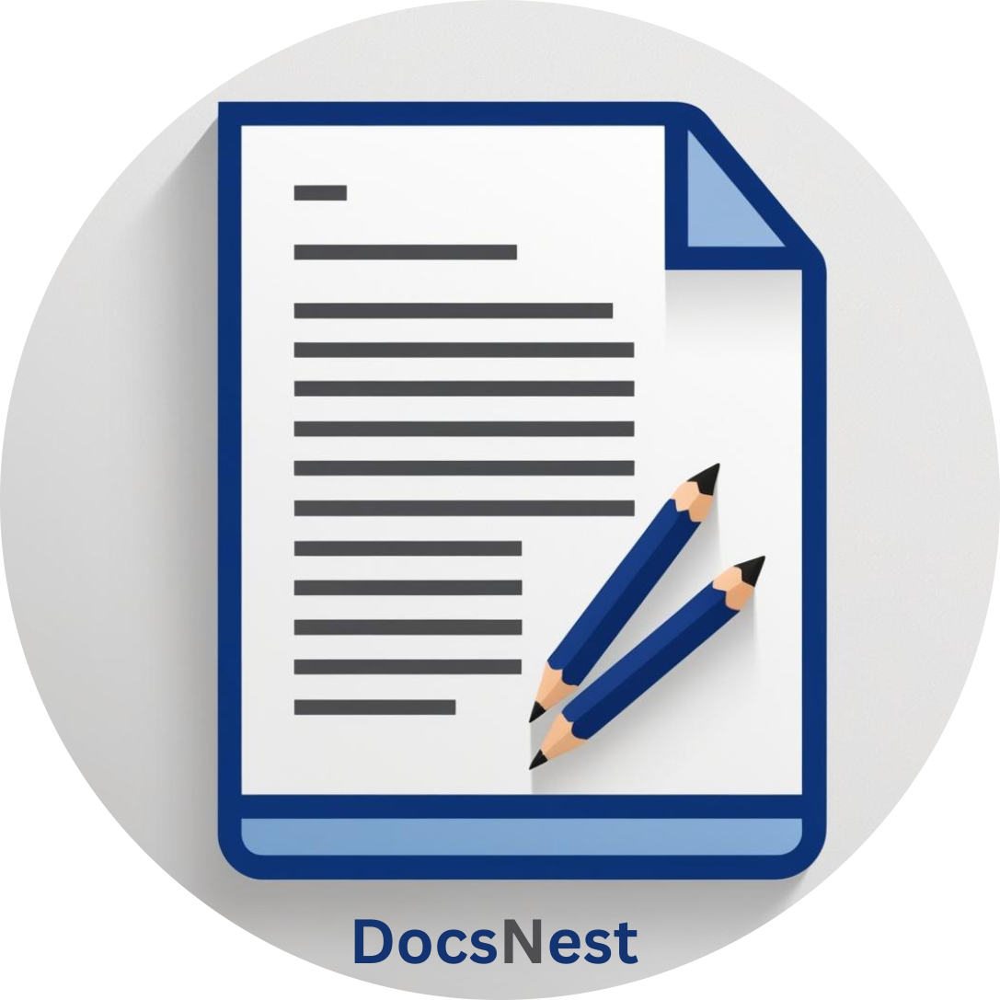
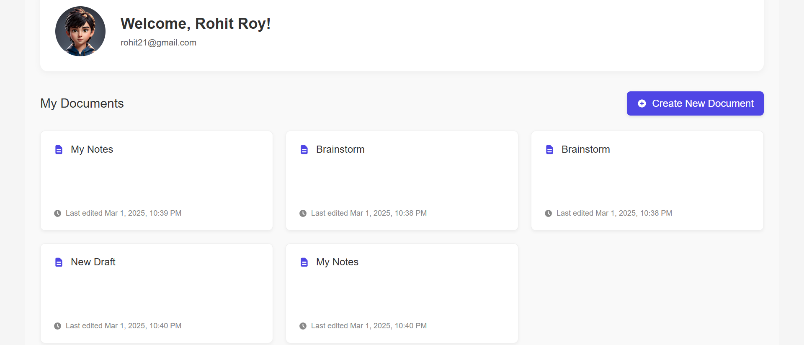
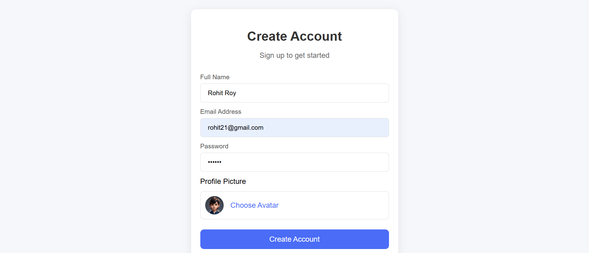
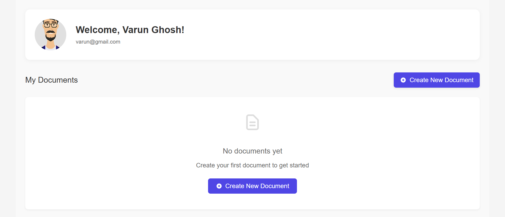
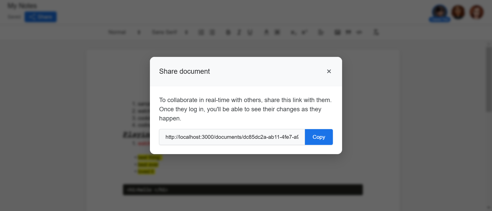
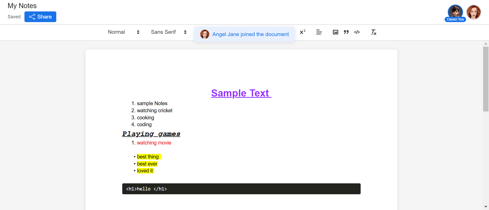
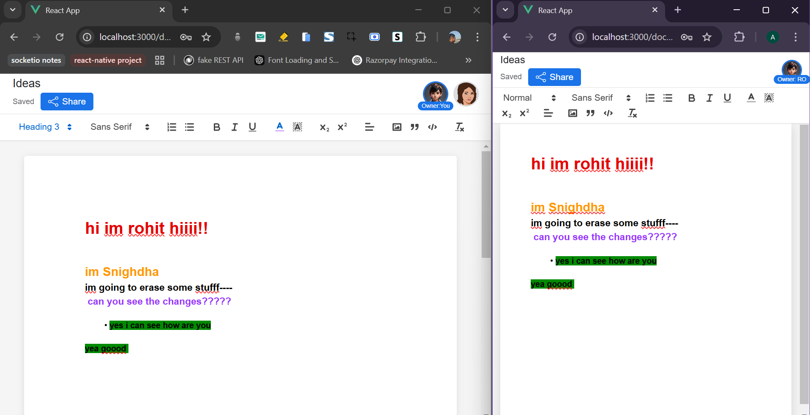

# 💻 DocsNest

<p align="center">
  
</p>

_**DocsNest** – A powerful, real-time collaborative document editor, built with modern web technologies, offering seamless document creation, auto-saving, and multi-user editing in a sleek, responsive interface._

## ✨ What This Project Does

**DocsNest** is an advanced document collaboration platform where users can create, edit, and share documents in real time. It ensures data persistence with an auto-save feature, allowing users to revisit and continue working on saved documents. Users can invite collaborators by sharing a document link, and upon joining, the document owner receives a notification. Each collaborator's presence is visually indicated in the top bar, mirroring the familiar experience of Google Docs.

## 🚀 Live Demo

Experience the project in action:

- 🌐 [Live Demo Link](https://aniket-bhadra.github.io/)

## 📸 Preview

### 🏠 Documents List in Profile Page



_View and manage all previously created documents with last modified timestamps._

---

## 🎞️ Interactive Previews

### 🔑 Getting Started


_Sign up or log in, start a new document, and see your edits auto-save in real time._

### 🔗 Sharing & Real-Time Collaboration


_Share documents via a link and collaborate with Multiple users simultaneously._

## 📷 Additional Screenshots

### SignUp Page




_Create a new account or log in to access your documents._


### Different Sections-1



_New users are greeted with a clean slate, ready to create their first document_

### Different Sections-2



_Click the "Share" button, copy the URL, and send it to collaborate in real time._

### Different Sections-3



_Get notified when a new collaborator joins, with their profile image displayed in the top bar_


### Different Sections-4



_Collaborate seamlessly with others in real time, where all changes are auto-saved instantly._

### Different Sections-5


_View all your created documents with their titles and last updated dates in a sleek, beautiful layout._

## ✨ Features

## ✨ Features

- 🔑 **Login & SignUp**: Create an account or log in to access and manage your documents.
- 📝 **Document Creation & Editing**: Start with a blank document and edit freely.
- 🔄 **Auto-Save & Persistence**: All changes are saved in real-time to the database.
- 👥 **Real-Time Collaboration**: Multiple users can work on the same document with live updates.
- 🔗 **Shareable Document Links**: Easily invite collaborators via link sharing.
- 🔔 **Join Notifications**: Document owners are notified when a new user joins.
- 📌 **User Presence Indicator**: View who is currently working on the document.
- 📜 **Document History & Last Edited Time**: See previously created documents with timestamps.
- 🎨 **Clean & Responsive UI**: A sleek, mobile-friendly design for seamless use.

## 🛠 Tech Stack

### 🚀 Frontend

- **Framework**: React
- **State Management**: Context API
- **Networking**: Axios
- **WebSocket**: Socket.IO for real-time collaboration
- **Editor**: Quill Editor
- **Routing**: React Router DOM
- **Unique ID Generation**: UUID

### 🖥️ Backend

- **Server**: Node.js with Express.js
- **Database**: MongoDB (Mongoose ORM)
- **Authentication & Security**: BcryptJS
- **WebSocket Communication**: Socket.IO

### 🚢 Deployment

- **Frontend**: Vercel
- **Backend**: Render

## 🔧 Installation

1. Clone the repository and navigate to the project folder:

   ```bash
   git clone https://github.com/yourusername/projectname.git
   cd projectname
   ```

2. Install dependencies for both frontend and backend:

   ```bash
   cd client
   npm install
   ```

   Open a new terminal:

   ```bash
   cd server
   npm install
   ```

3. Start the development servers:

   Backend:

   ```bash
   npm run devStart
   ```

   Frontend:

   ```bash
   npm start
   ```

## 🎮 Usage

- The app will be available locally at `http://localhost:3000`.

Accessing the Backend:

- Visit http://localhost:3001/ in your browser to check the API.
- All backend routes are defined in the server.js file.

## 🤝 Contributing

We welcome contributions! Please follow these steps:

1. Fork the repository
2. Create your feature branch (`git checkout -b feature/AmazingFeature`)
3. Commit your changes (`git commit -m 'Add some AmazingFeature'`)
4. Push to the branch (`git push origin feature/AmazingFeature`)
5. Open a Pull Request

## 📬 Contact

- linkedin - [https://www.linkedin.com/in/aniket-bhadra/](https://www.linkedin.com/in/aniket-bhadra/)
- Email - aniketbhadra2@gmail.com

## 📊 Project Metrics

&nbsp;&nbsp;&nbsp;&nbsp;
&nbsp;&nbsp;&nbsp;&nbsp;
&nbsp;&nbsp;&nbsp;&nbsp;
&nbsp;&nbsp;&nbsp;&nbsp;


## 💻 Project Details

&nbsp;&nbsp;&nbsp;&nbsp;
&nbsp;&nbsp;&nbsp;&nbsp;
&nbsp;&nbsp;&nbsp;&nbsp;
&nbsp;&nbsp;&nbsp;&nbsp;

### 📊 Project Overview

| 📌 **Metric**          | 📊 **Value**     |
| ---------------------- | ---------------- |
| 📈 **Total Commits**   | 1,247            |
| 🕒 **Last Commit**     | 2024-02-20       |
| 💾 **Repo Size**       | 12.5 MB          |
| 📝 **Languages Count** | 3                |
| 💡 **Top Language**    | JavaScript - 72% |
| ❓ **Open Issues**     | 5                |
| 🌐 **Platform**        | Web, Mobile      |
| 📦 **Dependencies**    | 12               |
| 📅 **Version**         | 1.0.0            |
| 🚀 **Status**          | Deployed         |

## 🚀 Upcoming Future Feature Progress

- 🖼️ **Image & Media Embedding**: Support inserting images and media files ░░░░░░░░░░░░░░░░░░░░░░ 0%
- 🔒 **Role-Based Access Control**: Set different permissions for collaborators ▓░░░░░░░░░░░░░░░░░░░░░ 10%

Made with ❤️ by [Aniket Bhadra](https://github.com/aniket-bhadra/)
